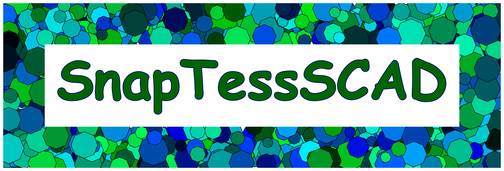

# docs

[Logo Rendering Script - Gist](https://gist.github.com/CameronBrooks11/7f44e17af9c78c67fe432197d06337dd)

## References

https://jwilson.coe.uga.edu/EMT668/EMAT6680.2001/Hembree/tessellations/hingedtessellations.html

https://e.math.cornell.edu/people/belk/projects/LaraMerling.pdf

https://en.wikipedia.org/wiki/Euclidean_tilings_by_convex_regular_polygons#Archimedean,_uniform_or_semiregular_tilings