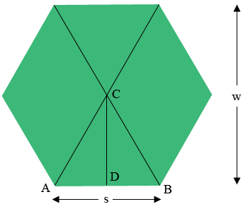

In the diagram, \( `w` \) is the width of the hexagon, and \( `s` \) is the side length.

### Side Length `s`

In a regular hexagon, each side forms part of equilateral triangles, like triangle \( `ABC` \). The measure of angle \( `DBC` \) is 60 degrees, and the tangent of this angle is given by:

&space;=&space;\frac{|CD|}{|DB|}})

Since \( \text{tan}(60^\circ) = \sqrt{3} \), we can write:

&space;=&space;\sqrt{3}&space;=&space;\frac{w/2}{s/2}&space;=&space;\frac{w}{s}})

Thus, the relationship between the width \( `w` \) and the side length \( `s` \) is:

### Solving for Side Length `s`

The side length \( `s` \) can be derived from the width \( `w` \) as:

### Example Calculation

If the width \( `w` \) is given, you can calculate the side length using the above formula. For instance, if \( `w = 8` \) feet, then:

This general relationship allows you to determine the side length of any regular hexagon based on its width.

## References

[1] [mathcentral.uregina.ca 'Hexagon Tangent Problem'](https://mathcentral.uregina.ca/QQ/database/QQ.09.19/h/rob1.html)
